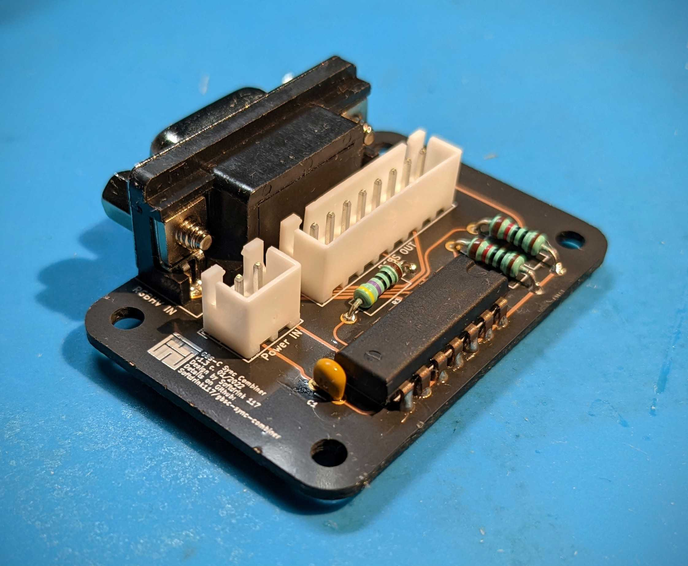
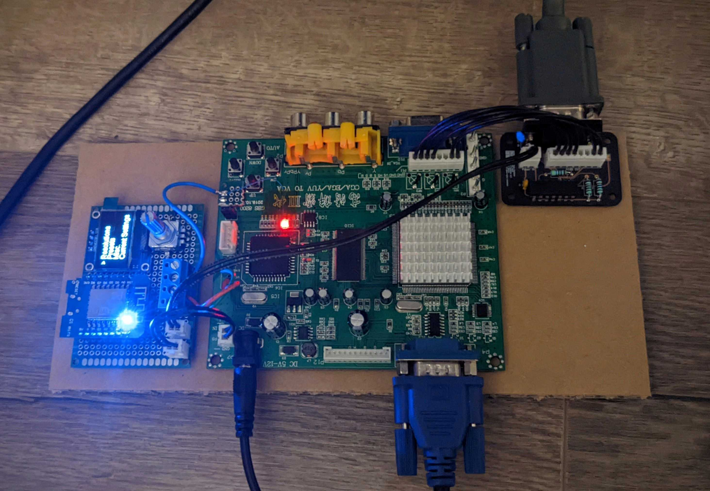
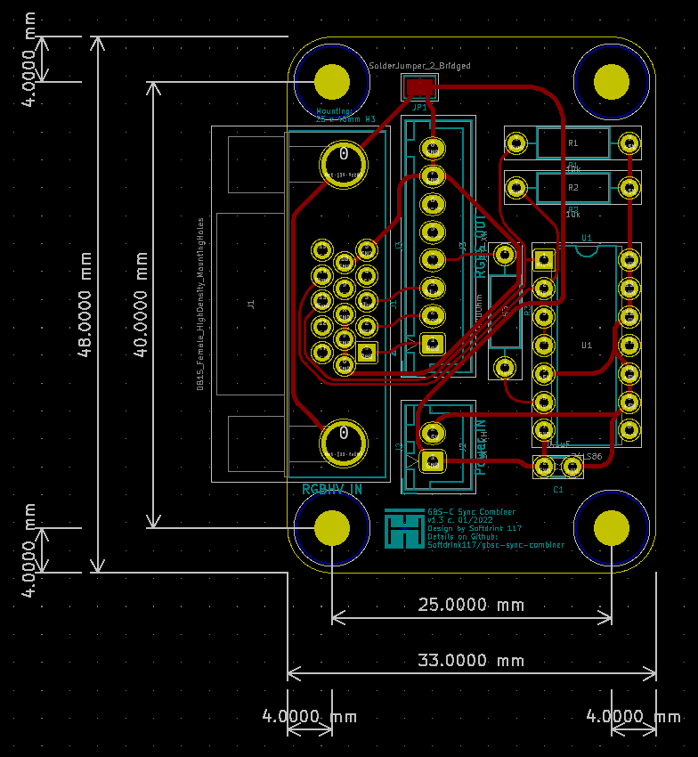
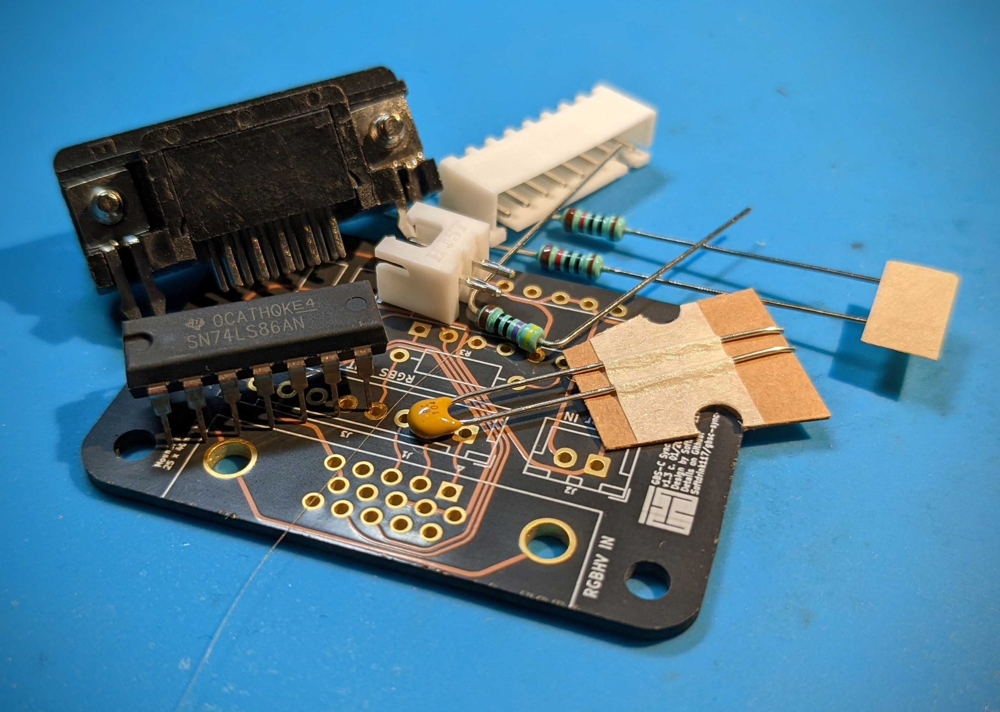
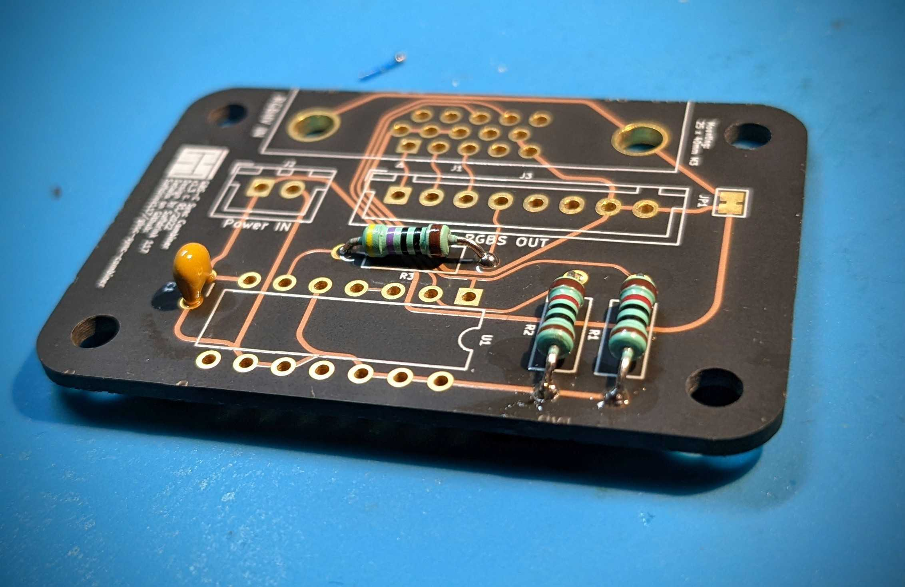
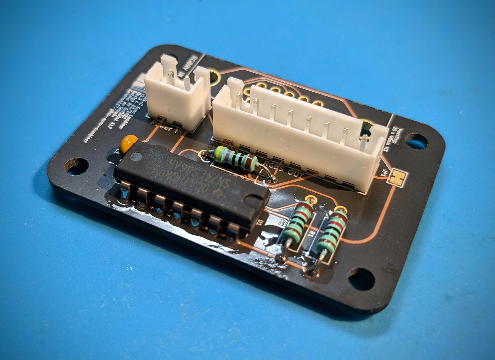
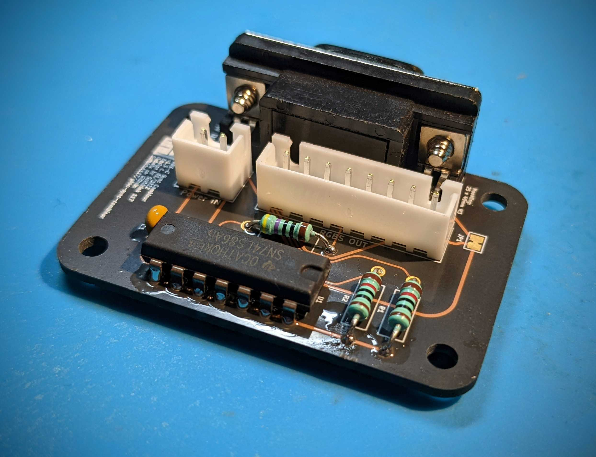

# GBSC Sync Combiner
V1.3  
Design by Tobias Heinemann / Softdrink 117 c. Jan 2022

-----

*A photo of an assembled GBSC Sync Combiner v1.3 PCB*

*A photo of a Sync Combiner connected to a GBS-Control setup.*

## Contents

- [Overview](#Overview)
- [Circuit Design](#Circuit-Design)
- [Board Design](#Board-Design)
- [Assembly](#Assembly)
- [BOM](#BOM)
  - [Required Components](#Required-Components)
  - [Headers](#Headers)
  - [Cable Assemblies](Cable-Assemblies)
- [Miscellaneous Notes](#Miscellaneous-Notes)
- [Acknowledgements](#Acknowledgements)

## Overview

 A simple sync combiner designed to convert RGBHV (VGA) into RGBS. Specifically built to be used with the GBS-Control project, which has some notable issues with RGBHV input under some circumstances (downscaling, etc.).

 The circuit is straightforward, using only a single logic IC and three resistors. The headers (`J2` and `J3`) are actually optional, and only included so that the module is plug-and-play compatible with the existing headers on the GBS board (`P9` and `P11`, respectively). If you wish, you can omit installation of the headers and solder wires directly between the Sync Combiner board and the GBS mainboard.

### Circuit Design

The sync combiner circuit used in this project is adapted from [TD-IO](https://github.com/tdaede/td-io), and is probably found in numerous other projects as well. It's a simplified XNOR design based around the 74x86 logic IC. Compared to other simple methods for sync combination, this is generally a very solid approach; however, it does have some limitations, and I cannot guarantee it will work with all signals.

For a more in-depth explanation of this circuit, [there's a great blog post from HD Retrovision](https://www.hdretrovision.com/blog/2019/10/10/engineering-csync-part-2-falling-short) that explains the XNOR technique in the context of other sync processing designs.

### Board Design

*Exported diagram from KiCAD's PCB editor, showing board dimensions and layout.*

The board is designed to be extremely simple. It is capable of being fabricated with a single-sided process, and measures 47mm x 33mm, with M3 mounting holes in a 25mm x 39mm pattern.

 > **Note:** There is a small solder jumper preconfigured in the closed position that links the shield of the VGA connector to ground. In the overwhelming majority of cases, this should be fine to keep closed; however, in some situations coupling the shield to ground can cause issues with interference. If you experience issues, you can cut the jumper open if necessary.

### Assembly

Due to the simple design of the circuit, basic through-hole soldering is all that is required. I'd recommend working from smaller to larger components (resistors and capacitor first, then IC and headers, and VGA connector last).

When building the (optional) cable assemblies, please take note that only six pins of the 8-pin video cable are actually used.

| 1&nbsp;&nbsp;&nbsp;&nbsp;&nbsp;&nbsp;&nbsp; | 2&nbsp;&nbsp;&nbsp;&nbsp;&nbsp;&nbsp;&nbsp; | 3&nbsp;&nbsp;&nbsp;&nbsp;&nbsp;&nbsp;&nbsp; | 4&nbsp;&nbsp;&nbsp;&nbsp;&nbsp;&nbsp;&nbsp; | 5&nbsp;&nbsp;&nbsp;&nbsp;&nbsp;&nbsp;&nbsp; | 6&nbsp;&nbsp;&nbsp;&nbsp;&nbsp;&nbsp;&nbsp; | 7&nbsp;&nbsp;&nbsp;&nbsp;&nbsp;&nbsp;&nbsp; | 8&nbsp;&nbsp;&nbsp;&nbsp;&nbsp;&nbsp;&nbsp; |
| :-: | :-: | :-: | :-: | :-: | :-: | :-: | :-: |
| Red | Green | Blue | Sync | | | GND | GND |

Also, please verify that the `P9` header on the GBS mainboard correctly indicates the power lines; the Sync Combiner will not function correctly if 5V and GND are reversed. This could result in damage to the Sync Combiner, the GBS mainboard, or even connected equipment in the worst case. I have not yet encounted a GBS board that is marked incorrectly, but there are many variations, and I cannot guarantee that all of them will match.

#### Assembly Photos

*Components for a Sync Combiner board.*

*First step of assembly: resistors and decoupling capacitor.*

*Second step of assembly: IC and headers.*

*Final step of assembly: VGA connector. Note that there is flux residue visible in this picture, which must be cleaned before use.*

### BOM

#### Required Components
| Part | Name | Quantity | Link | Notes |
| ---: | :--: | :------: | :----------- | :---- |
| J1 | Right-Angle Female VGA Connector | 1 | [Digikey](https://www.digikey.com/en/products/detail/adam-tech/HD15-SN-25/9832737) | Critical dimension is 'backset spacing' at 0.121" / 3.08mm. Many other right-angle VGA connectors exist that would be compatible.
| U1 | 74LS86 IC | 1 | [Digikey](https://www.digikey.com/en/products/detail/texas-instruments/SN74LS86AN/277315) |
| R1, R2 | 10 kOhm Resistor | 2 | [Digikey](https://www.digikey.com/en/products/detail/vishay-beyschlag-draloric-bc-components/SFR2500001002FR500/595641) | Pretty much any 10k through-hole resistor will work.
| R3 | 470 Ohm Resistor | 1 | [Digikey](https://www.digikey.com/en/products/detail/vishay-beyschlag-draloric-bc-components/SFR2500004700FR500/333902) | As above, pretty much any 470Ohm through-hole resistor will work.
| C1 | 0.1uF Capacitor | 1 | [Digikey](https://www.digikey.com/en/products/detail/vishay-beyschlag-draloric-bc-components/K104K15X7RF5TL2/286538) | Pretty much any 0.1uF decoupling capacitor with 2.5mm through-hole leads will work.

#### Headers
Optional, but allows the sync combiner to work as a plug-and-play add-on with corresponding cables. Omitting the headers will require directly soldering wires between the Sync Combiner and the GBS-C mainboard.

| Part | Name | Quantity | Link | Notes |
| ---: | :--: | :------: | :----------- | :---- |
| J3 | JST B8B-XH-A | 1 | [Digikey](https://www.digikey.com/en/products/detail/jst-sales-america-inc/B8B-XH-A-LF-SN/1651049), [GAM-GEC](https://gam-gec.com/product/b8b-xh-a/) | Digikey often has low stock of JST components; GAM-GEC is a US division of JST and usually has good stock.
| J2 | JST B2B-XH-A | 1 | [Digikey](https://www.digikey.com/en/products/detail/jst-sales-america-inc/B2B-XH-A-LF-SN/1651045), [GAM-GEC](https://gam-gec.com/product/b2b-xh-a/) | As above.

#### Cable Assemblies
Cable assemblies designed to connect the Sync Combiner with the GBS-C mainboard. These specific parts will give you an 8" (200mm) cable for power, and a 4" (100mm) cable for video signals. Depending on your desired install location, you may want to choose a different cable length; [there are several options available in 2" increments between 2 and 12 inches](https://www.digikey.com/en/product-highlight/j/jst/xh-series-connectors). It is also possible to crimp your own cable assemblies.

| Part | Quantity | Link | Notes |
| ---: | :------: | :----------- | :---- |
| JST XHP-8 | 2 | [Digikey](https://www.digikey.com/en/products/detail/jst-sales-america-inc/XHP-8/923773), [GAM-GEC](https://gam-gec.com/product/xhp-8/) | Digikey often has low stock of JST components; GAM-GEC is a US division of JST and usually has good stock.
| JST XHP-2 | 2 | [Digikey](https://www.digikey.com/en/products/detail/jst-sales-america-inc/XHP-2/555485), [GAM-GEC](https://gam-gec.com/product/xhp-2/) | As above.
| JST JUMPER SXH-001T-P0.6 X2 8" | 2 | [Digikey](https://www.digikey.com/en/products/detail/jst-sales-america-inc/ASXHSXH22K203/9961918) | Digikey often has good stock of these pre-terminated XH jumper wire assemblies.
| JST JUMPER SXH-001T-P0.6 X2 4" | 6 | [Digikey](https://www.digikey.com/en/products/detail/jst-sales-america-inc/ASXHSXH22K102/9961917) | As above.

#### Miscellaneous Notes
The *output side* RGB header - P12 on the single-output boards - uses JST PHR-12 (2mm pitch). The other headers on the board are mostly JST XH.

-----

### Acknowledgements

This project would not have been possible without the help of the following people:

- ["Hatsune" Mike](https://github.com/Mikejmoffitt)
- [Thomas Daede](https://github.com/tdaede)
